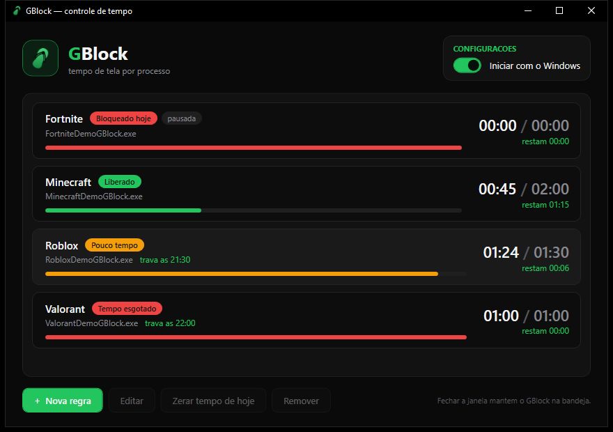
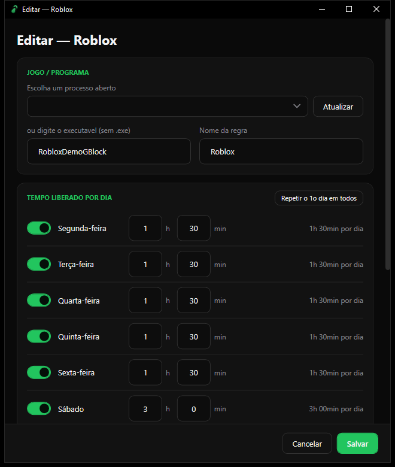
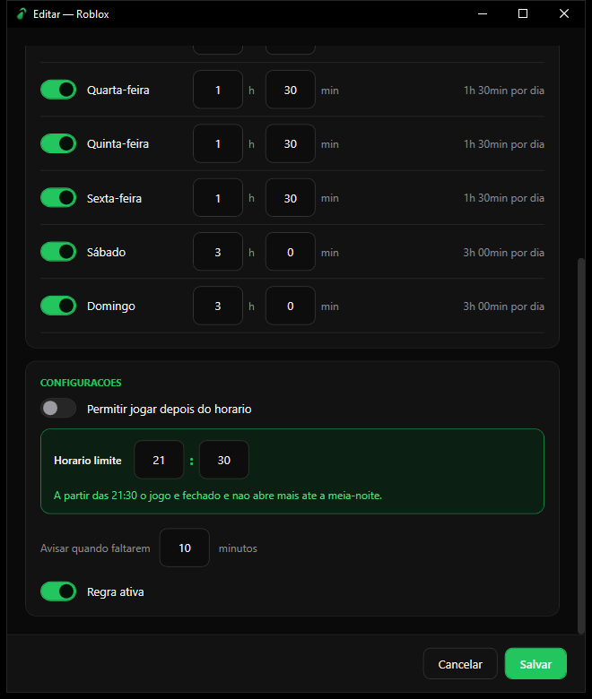

<p align="center">
  
</p>

<h1 align="center">GBlock</h1>

<p align="center">
  <b>Controle de tempo de jogo por processo no Windows.</b><br />
  Define quanto tempo cada jogo pode ficar aberto por dia, avisa antes de acabar e fecha na hora certa.
</p>

<p align="center">
  
  
  
</p>

<p align="center">
  
</p>

---

## Por que existe

"Só mais uma partida" vira a noite inteira. Os controles parentais do Windows e dos consoles
limitam a conta ou o aparelho inteiro, e não um jogo específico. Também não são fáceis de ajustar
para "1h30 de Roblox em dia de semana, 3h no fim de semana e nada depois das 21h30".

O GBlock nasceu para resolver só isso, de forma simples e local:

- **por jogo**: cada executável tem a sua regra e o resto do PC continua livre;
- **por dia da semana**: dia de aula e fim de semana podem ter limites diferentes;
- **com horário limite**: mesmo sobrando tempo, depois de certa hora o jogo não abre;
- **sem conta, sem nuvem, sem assinatura**: tudo fica em dois arquivos JSON na máquina.

Serve para pais que querem colocar limite no computador dos filhos e para quem quer se
autocontrolar. O ícone é um chinelo, o instrumento clássico de disciplina de toda mãe brasileira. 🩴

## O que ele faz

| | |
|---|---|
| ⏱️ **Limite diário por jogo** | Horas e minutos liberados para cada dia da semana (segunda a domingo). |
| 🔔 **Avisos antes de acabar** | Um card flutuante sempre no topo, mais um balão na bandeja. Aparece no tempo configurado e de novo aos 5 min e a 1 min. |
| 🛑 **Fecha quando acaba** | Ao zerar o saldo do dia, o processo e a árvore dele são encerrados. |
| 🚫 **Não deixa reabrir** | Abrir o jogo sem saldo faz ele ser fechado no ciclo seguinte (até 2 s). |
| 🌙 **Trava de horário** | Com "Permitir jogar depois do horário" desligado, o jogo é fechado a partir do horário limite e não abre até a meia-noite. |
| ⏸️ **Pausar regra** | Desliga uma regra sem apagá-la. |
| 🔄 **Zerar tempo de hoje** | Devolve o saldo do dia para uma regra (a recompensa por lição de casa feita 😉). |
| 🖥️ **Roda na bandeja** | Fechar a janela não para o monitor. Pode iniciar junto com o Windows, direto na bandeja. |

## Telas

### Tela principal

Cada regra mostra o status (liberado, pouco tempo, esgotado, bloqueado hoje, fora do horário), o
tempo usado sobre o limite, quanto resta e, quando existe, a trava de horário.

<p align="center">
  
</p>

### Criando/editando uma regra

Escolha o jogo na lista de processos abertos (ou digite o nome do executável) e defina o tempo
de cada dia da semana. O botão "Repetir o 1o dia em todos" copia o primeiro dia para os outros.

<p align="center">
  
</p>

### Configurações da regra: trava de horário

Com **Permitir jogar depois do horário** desligado, aparece o horário limite. No exemplo, o Roblox
é fechado às 21:30 e não abre mais até a meia-noite. Os avisos de "tempo acabando" também contam
esse horário.

<p align="center">
  
</p>

## Download

Baixe o **`GBlock-vX.Y.Z-win-x64.zip`** na página de
[**Releases**](https://github.com/Joaodacoregio/GBlock/releases/latest), extraia e rode o `GBlock.exe`.

- Não precisa instalar nada: o .NET já vai dentro do executável (self-contained, Windows 10/11 64 bits).
- Na primeira execução o Windows SmartScreen pode avisar "Windows protegeu o computador", porque o
  executável não é assinado digitalmente. Clique em **Mais informações** → **Executar assim mesmo**.
- Dica: deixe o `GBlock.exe` numa pasta fixa (ex.: `C:\Program Files\GBlock` ou `Documentos\GBlock`)
  antes de ligar "Iniciar com o Windows", já que o registro aponta para esse caminho.

## Como usar

1. Abra o jogo uma vez para que ele apareça na lista de processos.
2. No GBlock, clique em **+ Nova regra**, escolha o processo e defina o tempo de cada dia.
3. (Opcional) Em **Configurações**, desligue "Permitir jogar depois do horário" e defina o horário limite.
4. Salve. A partir daí, o GBlock conta o tempo sempre que o jogo estiver aberto.
5. Ligue **Iniciar com o Windows** para o monitor subir sozinho na bandeja.

## Como rodar

Requer o [.NET 10 SDK](https://dotnet.microsoft.com/download).

```bash
dotnet run --project "src/GBlock.App/GBlock.App.csproj"
```

Para gerar o executável (self-contained, arquivo único, sem precisar de .NET instalado na máquina):

```bash
dotnet publish "src/GBlock.App/GBlock.App.csproj" -c Release -r win-x64 --self-contained true -p:PublishSingleFile=true -p:IncludeNativeLibrariesForSelfExtract=true -p:EnableCompressionInSingleFile=true -o publish
```

Sai um `publish/GBlock.exe` de ~72 MB. Os `.pdb` ao lado servem só para depuração. O argumento
`--tray` inicia direto na bandeja, sem abrir a janela. É ele que a opção "Iniciar com o Windows"
grava no registro.

## Arquitetura

Camadas separadas por projeto, com a dependência sempre apontando para o domínio:

```
src/
  GBlock.Domain          modelos, enums e interfaces (sem dependências)
  GBlock.Service         regras de negócio: AvaliadorRegra + MonitorService
  GBlock.Infrastructure  persistência JSON, acesso a processos, auto-start no registro
  GBlock.App             WPF (MVVM) + ícone de bandeja
tools/
  GerarIcone.ps1         gera o ícone de chinelo (Assets/gblock.ico)
```

`GBlock.slnx` organiza os projetos em `01-Application`, `02-Domain`, `03-Service`,
`04-Infrastructure`.

### Como funciona por dentro

- **Monitor** (`MonitorService`): a cada 2 segundos verifica quais processos monitorados estão
  abertos e acumula o tempo. Grava o consumo em disco a cada ~30 segundos e ao sair.
- **Avaliação** (`AvaliadorRegra`): função pura que, a partir da regra, do horário atual e do tempo
  consumido, decide o status (liberado, aviso, esgotado, dia bloqueado ou fora do horário).
- **Encerramento**: com o status bloqueado, o processo é finalizado (`Kill` com a árvore de processos).
- **Dados**: `%AppData%\GBlock\regras.json` e `%AppData%\GBlock\uso.json` (histórico de 90 dias).
- **Ícone**: o chinelo é desenhado por `tools/GerarIcone.ps1`. Rode de novo para mudar cores ou formato:

  ```bash
  powershell -ExecutionPolicy Bypass -File tools/GerarIcone.ps1
  ```

## Duas decisões que vale conhecer

**Não é um Serviço do Windows.** Um serviço roda na sessão 0 e não consegue abrir janelas nem
colocar ícone na bandeja. Precisaria de um segundo processo só para a interface, com IPC entre os
dois. Como contar tempo, avisar e fechar só faz sentido com o usuário logado, o GBlock roda como app
de bandeja com auto-start pela chave `Run` do usuário. O `MonitorService` já está isolado do WPF e
pode ser hospedado num Worker Service sem alteração, caso um dia seja preciso impedir que ele seja
fechado pelo Gerenciador de Tarefas.

**Sem elevação.** O `app.manifest` usa `asInvoker`. Jogos que rodam como administrador (alguns
anticheats) não podem ser encerrados assim. Nesse caso, troque para `requireAdministrator` no
manifesto.

## Limitações conhecidas

- O bloqueio é reativo: fecha até 2 s depois de abrir, mas não impede o `CreateProcess`. Um
  bloqueio real na abertura exigiria driver ou política do Windows.
- Quem tem acesso ao `%AppData%` pode editar o `uso.json` e recuperar tempo.
- O tempo conta enquanto o processo existe, e não só enquanto a janela está em foco.
- A trava de horário vale do horário limite até a meia-noite. Com um limite na madrugada (ex.:
  01:00), o jogo fica travado da 01:00 até a meia-noite.
